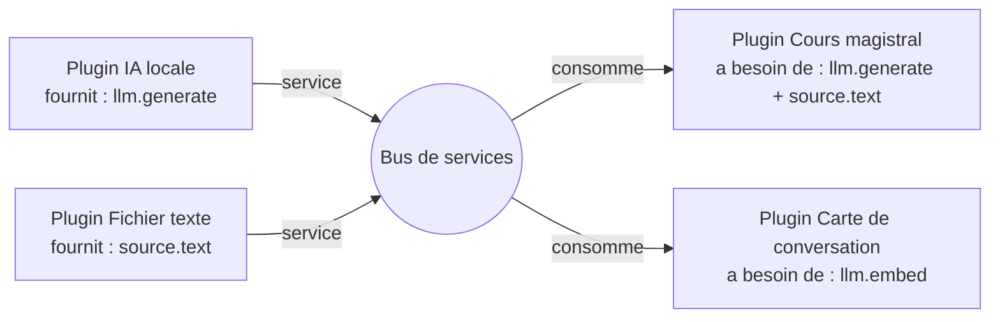

# Glucose — Vision du système de plugins

> **Principe :** Glucose ne propose **rien**. Tout ce qui apparaît dans la page Plugins
> a été apporté par un plugin — y compris l'IA, y compris le choix d'un fichier.
>
> **Corollaire :** l'application n'est pas un moteur avec des extensions. C'est un
> **bus** entre des plugins qui se connaissent et s'entraident.

**Statut :** document de vision (le code d'aujourd'hui ne l'implémente pas encore — voir
[§9 Écart avec le code actuel](#9-écart-avec-le-code-actuel)).
Il répond à l'item « Spécifier le contrat plugin » de [ROADMAP.md](ROADMAP.md).

---

## 1. La coquille vide

À la première ouverture, la page Plugins contient **un seul élément** :

```
┌─────────────────────────────┐
│  Installer un plugin…       │   ← en haut, toujours au même endroit
├─────────────────────────────┤
│                             │
│         (rien)              │   ← aucun texte d'accueil, aucune suggestion,
│                             │      aucun moteur « par défaut »
└─────────────────────────────┘
```

Ce qu'il n'y a **pas**, et qu'il ne doit jamais y avoir :

- pas de moteur pré-installé ;
- pas de section « IA locale » ;
- pas de bouton « Choisir un texte » ;
- pas de message expliquant ce qu'un plugin pourrait faire.

Le vide est une position, pas un oubli. Un utilisateur qui n'installe rien a une page
vide et une application complète : le canvas ne dépend d'aucun plugin.

---

## 2. Installer un plugin crée un tiroir

Installer un plugin — **n'importe lequel** — crée un **tiroir d'utilisation** dans la
page. Le tiroir est l'unique territoire du plugin. On y retrouve :

1. **ses réglages**, s'il en a ;
2. **tous les boutons qu'il crée lui-même**, quels qu'ils soient.

Le tiroir est **entièrement décrit par le plugin**. L'application ne connaît ni le nom
des boutons, ni leur ordre, ni leur nombre. Elle sait seulement dessiner un tiroir et
transmettre les clics.

```
┌─────────────────────────────┐
│  Installer un plugin…       │
├─────────────────────────────┤
│ ▾ IA locale                 │   ← tiroir posé par le plugin « IA locale »
│     ● Ollama actif          │
│     [Installer Ollama]      │
│     Modèle : ( ) 7b (•) 32b │
├─────────────────────────────┤
│ ▾ Cours magistral           │   ← tiroir posé par un autre plugin
│     [Choisir un texte…]     │
│     Densité : (•) normal    │
│     [Lancer]                │
└─────────────────────────────┘
```

Deux plugins installés = deux tiroirs. Zéro plugin = zéro tiroir, et la page redevient
le bouton du §1.

---

## 3. Les services inter-plugins

C'est le cœur de la vision.

Un plugin ne se contente pas de **faire** quelque chose. Il peut **déclarer de lui-même
qu'il PEUT servir aux autres**. Il publie alors un ou plusieurs **services**, que
n'importe quel autre plugin peut consommer sans savoir qui les fournit.

> Tout le système d'IA — installer Ollama, sonder la machine, choisir le bon modèle,
> télécharger, générer — n'est pas une fonction de Glucose. C'est un **service**, offert
> par un plugin « IA locale » à tous les autres.



Conséquences voulues :

- Le plugin « Cours magistral » **ne contient aucun code Ollama**. Il demande « une IA
  qui génère du texte » et se moque de savoir laquelle.
- Remplacer l'IA locale par une IA distante = installer un autre plugin fournisseur.
  Aucun consommateur n'est modifié.
- Deux plugins qui font le même travail ne le refont pas deux fois : ils partagent le
  fournisseur, et donc le modèle déjà chargé en mémoire.

**Chaque plugin connaît les autres et interagit avec eux au maximum.** C'est là qu'est
l'optimisation : pas dans l'application, dans le réseau qu'ils forment.

---

## 4. Anatomie d'un plugin

Un plugin = un binaire + un manifeste. Le manifeste décrit **quatre choses** :

| Bloc | Rôle |
|---|---|
| **identité** | id, nom, version, description |
| **tiroir** | les contrôles à afficher : boutons, réglages, états |
| **fournit** (`provides`) | « je PEUX servir aux autres » — les services publiés |
| **a besoin de** (`needs`) | les services demandés aux autres plugins |

### Un fournisseur pur — « IA locale »

Il n'a pas de bouton « Lancer ». Il expose de quoi préparer une IA, et publie trois
services.

```json
{
  "id": "ia-locale",
  "name": "IA locale",
  "version": "1.0",
  "drawer": {
    "controls": [
      { "type": "status", "id": "demon",  "label": "Ollama" },
      { "type": "button", "id": "install", "label": "Installer Ollama" },
      { "type": "enum",   "id": "modele",  "label": "Modèle",
        "source": "models" }
    ]
  },
  "provides": [
    { "service": "llm.generate", "version": 1, "label": "Génération de texte" },
    { "service": "llm.embed",    "version": 1, "label": "Vecteurs sémantiques" },
    { "service": "llm.specs",    "version": 1, "label": "Capacités de la machine" }
  ],
  "needs": []
}
```

### Un consommateur — « Cours magistral »

Il n'embarque ni Ollama, ni sélecteur de fichier. Il **demande** les deux.

```json
{
  "id": "cours-magistral",
  "name": "Cours magistral",
  "version": "1.0",
  "drawer": {
    "controls": [
      { "type": "file",   "id": "texte",   "label": "Choisir un texte…",
        "accept": ["txt", "md", "markdown"] },
      { "type": "enum",   "id": "densite", "label": "Densité",
        "choices": ["concis", "normal", "détaillé"], "default": "normal" },
      { "type": "button", "id": "lancer",  "label": "Lancer", "primary": true,
        "requires": ["texte"] }
    ]
  },
  "provides": [],
  "needs": [
    { "service": "llm.generate", "version": 1, "onMissing": "propose" }
  ]
}
```

Le bouton « Choisir un texte » appartient au plugin, **pas à la page**. Le champ
`requires` dit à l'application quand le bouton « Lancer » est utilisable : c'est le
plugin qui définit ses propres conditions, et donc le plugin qui est responsable de dire
ce qui manque.

---

## 5. Ce qu'un plugin peut poser dans son tiroir

Vocabulaire minimal, volontairement pauvre — un plugin décrit une **intention**, jamais
des pixels (cf. [style.md](style.md) : la chrome reste monochrome et plate).

| Contrôle | Ce que ça donne |
|---|---|
| `button` | une action ; `primary: true` pour l'action principale du tiroir |
| `enum` / `bool` | un réglage ; `source` pour une liste calculée à chaud (ex. modèles installés) |
| `file` / `folder` | un sélecteur, avec ses extensions acceptées |
| `text` | une saisie courte |
| `status` | un état vivant (pastille + libellé), rafraîchi par le plugin |
| `progress` | une progression, alimentée par le flux du plugin |

Règle : **tout libellé vient du plugin**. L'application n'écrit jamais de texte dans un
tiroir qu'elle n'a pas reçu.

---

## 6. Résolution des besoins

Quand un plugin déclare `needs`, quatre cas :

| Situation | Comportement attendu |
|---|---|
| Un fournisseur existe | Branchement silencieux. Rien à afficher. |
| Aucun fournisseur | Le tiroir dit ce qui manque, en langage humain, et propose d'installer le plugin qui le fournit (`onMissing: "propose"`). |
| Plusieurs fournisseurs | L'utilisateur choisit une fois ; le choix est mémorisé, modifiable dans le tiroir du consommateur. |
| Le fournisseur est désinstallé | Les consommateurs le disent immédiatement ; ils ne se cassent pas, ils redeviennent en attente. |

Un bouton n'est jamais grisé sans qu'une ligne, juste en dessous, dise pourquoi. Cette
règle vient d'un bug réel : un « Lancer » gris à vie parce que rien n'était installé, et
aucun texte pour le signaler.

---

## 7. Chorégraphie d'un lancement

1. L'utilisateur clique sur un bouton du tiroir de **Cours magistral**.
2. L'application transmet l'action + la valeur des contrôles au plugin.
3. Le plugin appelle `llm.generate` — sans savoir qui répond.
4. Le bus route vers le plugin **IA locale**, qui parle à Ollama.
5. Le plugin **IA locale** émet sa progression ; **Cours magistral** émet la sienne ;
   chaque tiroir affiche la sienne, pas celle du voisin.
6. Le résultat revient à **Cours magistral**, qui produit un board.
7. L'application importe le board **comme un nouveau board** — jamais en écrasant le
   travail en cours.

L'application ne comprend aucune des étapes 3 à 6. Elle route, elle affiche, elle
protège le disque et les données de l'utilisateur.

---

## 8. Les invariants

Ce qui ne doit pas être négocié, même sous la pression d'un cas particulier :

1. **Rien n'est pré-installé.** Pas de moteur « pour dépanner », pas d'exception.
2. **L'application ne possède aucune fonctionnalité de plugin.** Si Glucose sait faire
   quelque chose que seul un plugin devrait savoir faire, c'est un bug d'architecture.
3. **Un plugin = un tiroir.** Pas d'élément de plugin ailleurs dans l'interface.
4. **Les libellés appartiennent aux plugins.**
5. **Un service est anonyme.** Un consommateur ne nomme jamais son fournisseur.
6. **La donnée de l'utilisateur passe avant tout.** Un plugin ajoute, il n'écrase pas.
7. **L'IA décide le sens, le code décide la géométrie** (règle d'or héritée du moteur
   `glucose-notes`, cf. ROADMAP.md) : un modèle ne renvoie jamais de coordonnées.

---

## 9. Écart avec le code actuel

Aujourd'hui (v1.0.1-beta.24), le code **contredit** cette vision sur quatre points. Il
faut le dire clairement plutôt que de laisser croire que la vision est déjà là.

| Aujourd'hui | Vision |
|---|---|
| La section « IA locale » (Ollama, specs, modèle) est codée **dans le panneau**, en dur. | Un plugin « IA locale » qui fournit `llm.*`. |
| Le bouton « Choisir un texte… » est codé **dans le panneau**. | Un contrôle `file` déclaré par le plugin qui en a besoin. |
| Un **moteur intégré** (« Cours magistral ») est livré avec l'application, toujours présent. | Rien de pré-installé. Ce moteur devient un plugin comme un autre. |
| Un plugin ne peut **rien offrir** aux autres : `manifest.json` décrit un binaire, une commande et des options. | `provides` / `needs` et un bus de services. |

Ce qui, en revanche, est déjà conforme :

- l'installation d'un plugin depuis un dossier (`install_plugin`), sa découverte
  (`list_plugins`), son exécution (`run_plugin`) ;
- les **options auto-câblées** : l'UI est déjà générée depuis le manifeste, jamais codée
  en dur par plugin. C'est exactement le mécanisme à étendre au tiroir entier ;
- le résultat importé **comme nouveau board**, sans rien écraser ;
- le garde-fou disque (`validate_scope`) et l'id de plugin assaini (anti-traversal).

### Chemin de migration (ordre conseillé)

1. **Généraliser le tiroir** : rendre tout le contenu d'un tiroir depuis le manifeste
   (les contrôles du §5), au lieu des sections codées en dur.
2. **Sortir « Choisir un texte »** du panneau vers un contrôle `file` déclaré.
3. **Extraire l'IA locale** en plugin fournisseur : les commandes Rust existantes
   (`system_specs`, `ollama_status`, `install_ollama`, `pull_model`, `ollama_generate`)
   deviennent l'implémentation d'un plugin, plus des fonctions de l'application.
4. **Introduire `provides` / `needs`** et le registre de services.
5. **Retirer le moteur intégré** de l'application et le publier comme premier plugin
   installable — la page redevient vide au premier lancement.

L'étape 3 est la plus structurante : c'est elle qui transforme Glucose de « application
avec de l'IA dedans » en « bus où l'IA est un service parmi d'autres ».

---

## 10. Questions ouvertes

À trancher avant d'écrire la première ligne de l'étape 4 :

- **Sécurité.** Un plugin est du code arbitraire ; un plugin qui en appelle d'autres
  amplifie la portée d'un plugin malveillant. Registre signé + hash vérifié + périmètre
  disque restreint : à quel niveau, et qui autorise quoi ?
- **Versions de services.** `llm.generate@1` : que se passe-t-il quand un fournisseur
  passe en `@2` et qu'un consommateur reste en `@1` ?
- **Cycle de vie.** Un fournisseur doit-il rester chargé entre deux appels (garder le
  modèle en mémoire) ? Qui décide de le décharger ?
- **Coût affiché.** Un service peut être lent (une IA locale sur un petit GPU produit
  quelques mots par seconde). Le fournisseur doit-il annoncer un ordre de grandeur pour
  que le consommateur prévienne l'utilisateur avant de lancer ?
- **Découverte.** Comment un plugin apprend-il qu'un autre existe et pourrait lui être
  utile — annuaire local uniquement, ou registre distant ?
