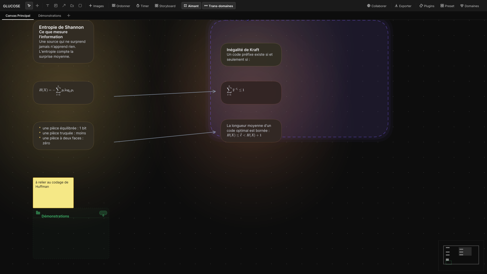
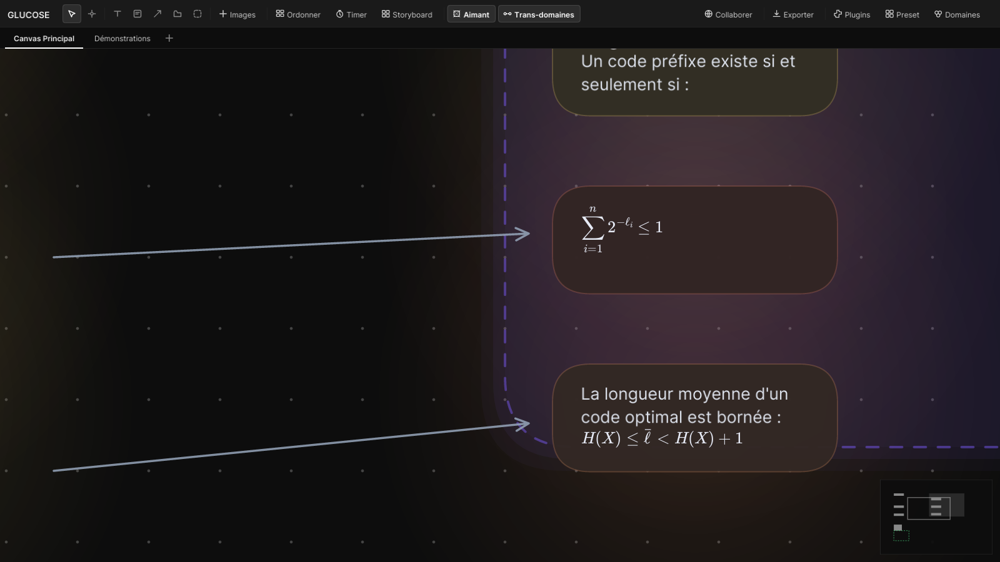

<div align="center">

# 🧬 Glucose

### Le canvas infini de pensée visuelle, réécrit en Rust natif — 0 dépendance dans le noyau, huit assumées autour

*Pose. Relie. Zoome. Explore.*

[](LICENSE)
[](https://www.rust-lang.org/)
[](#-ce-qui-est-mesuré-pas-affirmé)
[](#-les-formules-sont-natives)

[**📖 Guide**](GUIDE.md) · [**🗺️ Dossier d'architecture**](docs/architecture/00-INDEX.md) · [**🐛 Issues**](../../issues)

</div>

---

## ✨ Qu'est-ce que c'est ?

**Glucose** est un canvas infini pour penser en images et en texte — moodboard, cartes Markdown,
formules, membranes, dossiers-sous-canvas, flèches sémantiques. La version d'origine tournait
sur Tauri et TypeScript ; **ce dépôt la recrée en Rust natif**, avec le même rendu et les mêmes
fonctionnalités pour cible, et un code qui, lui, ne doit rien à l'ancien.

Deux partis pris, tenus par des tests plutôt que par des promesses :

- 🛡️ **Le noyau (`glucose-core`) n'a aucune dépendance.** Modèle, géométrie, index spatial,
  alignement, undo par journal, format de fichier, SHA-256 : tout est écrit sur `std`, et
  `cargo tree -p glucose-core` le prouve.
- 🎯 **Ce qui est affiché est fidèle.** Le thème, la grille, les cartes, les poignées, la teinte
  symbiotique sont comparés aux valeurs de la référence par des tests — la teinte l'est au bit
  près, sur des vecteurs produits par le code TypeScript d'origine.

Autour du noyau, huit dépendances assumées, chacune derrière une frontière : `winit` et
`softbuffer` (fenêtre et présentation), `tiny-skia` (rastérisation), `fontdue` (glyphes),
`image` (décodage), `rfd` (dialogues), `arboard` (presse-papiers) et `katex-rs` (mise en page des
formules, isolée dans sa propre crate).

Développé et mesuré sous **Windows**. La pile est portable, mais aucune autre plateforme n'a
encore été vérifiée : le dire est plus utile que le promettre.

---

## 📸 À quoi ça ressemble

<div align="center">



*Un tableau de travail : cartes Markdown, membrane colorée, dossier-sous-canvas, flèches, minimap — et des formules LaTeX rendues nativement.*

</div>

### 🧮 Les formules sont natives

Glucose rend le LaTeX **sans navigateur, sans JavaScript et sans moteur de rendu HTML**. La mise
en page vient de [`katex-rs`](https://crates.io/crates/katex-rs), le portage Rust de KaTeX ; le
dessin est fait par le rastériseur du projet, avec les vingt fontes de KaTeX embarquées (540 Ko).

Conséquence directe : une formule est **vectorielle**, donc nette à n'importe quel zoom — ce
n'est pas une image que l'on agrandit.

### ✍️ Le Markdown en ligne est du vrai texte stylé

`**gras**`, `*italique*`, `~~barré~~` et `` `code` `` se composent avec **cinq polices
embarquées** : quatre Inter — droit, gras, italique, gras italique — et JetBrains Mono pour le
code. Pas d'oblique synthétique, pas de fausse graisse : chaque style est un fichier de fonte,
et la mesure d'une ligne tient compte du visage de chaque fragment, donc le retour à la ligne
tombe où le texte se dessine vraiment.

Au repos les signes disparaissent ; pendant l'édition ils réapparaissent en gris, `# ` compris —
c'est **la même mise en page**, à une largeur nulle près pour les signes effacés, ce qui garantit
que le curseur vise le bon octet dans les deux vues.

### 🖱️ La sélection de texte est celle qu'on connaît

Glisser sélectionne, un double-clic prend un mot, un triple un paragraphe, et `Maj`+clic **étend
depuis l'ancre** — de quoi relier deux points sans avoir à glisser d'un trait entre eux. Un
glisser entamé par un double-clic continue de prendre des mots entiers, dans les deux sens.

Au clavier : `Ctrl`+flèches par mot, `↑ ↓` à **colonne gardée** (elle est mémorisée, donc le
curseur ne dérive pas vers la gauche à force de monter et descendre), `Début`/`Fin` sur la ligne
**visible** — pas le paragraphe —, `Ctrl+A`, et copier-couper-coller **dans** le texte. Les
accents composés passent par la couche de composition du système, donc taper `é` fonctionne sur
n'importe quelle disposition.

<div align="center">



*Le même document à ×1,9. Les sommes gardent leurs bornes, les exposants leur place, et rien
n'est pixelisé : tout est retracé.*

</div>

Une formule qui ne compile pas n'est pas avalée en silence : elle s'affiche **en rouge, avec sa
source**, là où elle est.

---

## 📊 Ce qui est mesuré, pas affirmé

Chaque chiffre de ce tableau se reproduit par une commande, sur des documents synthétiques
déterministes (`glucose_core::synth`). *Mesures refaites le 2026-09-14.*

| | Mesure | Comment la refaire |
|---|---|---|
| **Tests** | **907**, zéro échec, zéro avertissement de compilation, clippy strict à zéro | `cargo test --workspace` · `cargo clippy --workspace --all-targets -- -D warnings` |
| **Dépendances du noyau** | **0** — `glucose-core` n'utilise que la bibliothèque standard | `cargo tree -p glucose-core` |
| **10⁷ nœuds en mémoire** | **423,8 Mo**, index spatial compris | `cargo run --release -p glucose-core --example bench_arena` |
| **Chargement de 10⁷ nœuds** | **141 ms** | idem |
| **Requête de viewport** | **0,21 µs** | idem |
| **Une image de rendu** | **1,2 ms** à mille nœuds, **3,9 ms** à dix mille (1080p) ; **7,6 ms** à mille nœuds en **4K** | `cargo run --release -p glucose-desktop --example bench_frame` |
| **Le rendu est reproductible** | deux images de la même scène sont **identiques au bit près** | `cargo test -p glucose-desktop --lib bench` |

Le banc n'est pas décoratif. En une journée d'existence, il a trouvé que le rendu **n'était
pas** déterministe — un toast portait une horloge, et deux images de la même scène différaient
de sept mille pixels — puis que la minimap redessinait un rectangle par nœud à chaque image, et
que la grille de fond construisait huit mille cercles de Bézier par image en 4K.

| Une image, à dix mille nœuds, au zoom 1 | Avant | Après | |
|---|---:|---:|---|
| 1080p | 17,3 ms | **4,1 ms** | ×4,2 |
| 1440p | 37,3 ms | **8,2 ms** | ×4,5 |
| 4K | 27,2 ms | **11,1 ms** | ×2,4 |

Le budget de 10 ms n'est pas encore tenu partout — la 4K à dix mille nœuds le dépasse d'une
milliseconde, et les documents très dézoomés ou à cent mille nœuds restent loin. Ce qui reste
est chiffré poste par poste dans la [fiche 12](docs/architecture/12-PLAN-D-EXECUTION.md) ; le
premier poste en 4K est désormais l'effacement du fond, un coût de surface que seule une couche
de présentation GPU réduira.

---

## 🧭 Où en est le portage, honnêtement

La cible est **exactement** Glucose Tauri, visuellement et fonctionnellement. Ce tableau dit ce
qui est **branché** — utilisable, annulable, enregistré —, ce qui **existe dans le noyau sans
geste** pour l'atteindre, et ce qui **n'existe pas encore**. Il est tenu à jour à chaque
chantier ; l'inventaire détaillé, fonctionnalité par fonctionnalité, est dans le
[dossier d'architecture](docs/architecture/00-INDEX.md).

| Domaine | ✅ Branché | 🧩 Noyau écrit et testé, sans geste | ❌ Pas encore |
|---|---|---|---|
| **Canvas & caméra** | canvas infini, pan (milieu, droit, `Espace`), zoom au curseur borné, grille adaptative, minimap cliquable, DPI | | signets de vue, cadrage sur le contenu, défilement horizontal |
| **Sélection & manipulation** | clic, `Maj`+clic, `Ctrl+A`, sélection élastique, **cycle de profondeur au clic** (PICK-1 : re-cliquer atteint le nœud du dessous), déplacement à la souris **et au clavier** (`←↑→↓`, `Maj` par dix), magnétisme avec guides (SNAP-1), redimensionnement à huit poignées avec ratio, curseurs de poignées, **verrouillage** `L` (cadre rouge, poignées retirées), **ordre d'empilement** `Ctrl+]` / `Ctrl+[`, dupliquer, supprimer, **barre d'action flottante** (compte, verrouiller, supprimer), **menu contextuel** au clic droit sur place, **rotation** (`Alt` + coin, `Maj` par huitièmes de tour) | | | menu contextuel, barre d'action flottante, rotation, verrouillage, ordre d'empilement, déplacement au clavier |
| **Images** | import par dialogue (`Ctrl+I`), dépôt d'un fichier depuis l'explorateur, collage `Ctrl+V`, PNG / JPEG / WebP / GIF / BMP | | dépôt multi-fichiers et **depuis un navigateur**, mipmaps, cache borné, décodage asynchrone, vidéos |
| **Cartes texte** | création, édition en place, retour à la ligne, hauteur qui suit le contenu, **les genres de bloc** — titres `#` à `######`, puces, listes numérotées, citations, blocs de code clôturés, séparateurs `---`, petit texte `-# ` —, **Markdown en ligne** — gras, italique, barré, code en chasse fixe, échappement `\*` — signes grisés pendant l'édition, **sélection complète** (souris, double et triple-clic, `Maj`, mots, `↑↓` à colonne gardée, copier-couper-coller, IME), **LaTeX** `$…$` et `$$…$$` avec **délimiteurs verts s'il compile, rouges sinon** et **prévisualisation en direct** à côté de la carte **liens** `[texte](url)` bleus et soulignés, ouverts au `Ctrl`+clic, **tableaux** aux colonnes alignées | ancres de texte robustes | sélection à la souris dans un pense-bête, annuler pendant la saisie |
| **Notes adhésives** | création, édition, opérateurs ET / OU / MAIS / PARCE QUE affichés | | choix de couleur, raccourcis d'opérateur, pilule colorée |
| **Flèches** | création (taille fixe), rendu droit | ancrage au bord des nœuds | dessin par glisser, sélection, courbes, waypoints, étiquette, prédicats sémantiques, portails |
| **Membranes** | création (taille fixe), rendu, titre éditable | adoption au dépôt, modes minimisé et étiré, mode focus, tween | dessin par glisser, panneau d'options, couleur dérivée des domaines |
| **Dossiers & miroirs** | outil Dossier, rendu, entrée au double-clic avec plongée animée, fil d'Ariane | miroirs avec détection de cycle | badge compteur (affiche zéro), mini-carte de contenu, miroir d'un dossier du disque |
| **Domaines** | créer / renommer / colorer / supprimer avec cascade, assignation pondérée, jauges sur les nœuds | | filtrage, couleur de membrane dérivée |
| **Undo / redo** | `Ctrl+Z` / `Ctrl+Y`, journal d'éditions (le coût ne dépend pas du document), un geste = une entrée, la navigation hors historique | | coalescence de la frappe, libellés d'action, Time Machine |
| **Persistance** | `Ctrl+S` / `Ctrl+Maj+S` / `Ctrl+O`, format `.glucose` v2 binaire avec somme de contrôle par section, écriture atomique, actifs dédupliqués par SHA-256, alerte à la fermeture | | autosave, versions durables, récupération après crash, import des fichiers Tauri (v1) |
| **Panneaux** | Ordonner (applique une disposition), Pomodoro (décompte réel), Domaines | | Storyboard, Presets et Plugins sont des **façades honnêtes** — ils disent ce qu'ils ne font pas ; Collaborer, Exporter, Recherche, Time Machine, réglette temporelle, HUD |
| **Export** | | SVG et Markdown, sans écriture disque | HTML, PNG, le menu, l'écriture sur le disque |
| **Temporalité, rideaux** | | calculs de timeline, modèle et panneau de rideau | tout le reste |
| **Collaboration, plugins** | | | rien |

Le rendu de ce qui est branché suit une règle unique : une carte se dessine en unités monde
puis subit **une seule** transformation — jamais une borne par valeur — et le texte est posé au
quart de pixel. La preuve est un test permanent qui compare l'encre d'une carte à cinq zooms.

---

## 🏗️ Architecture du workspace

```
crates/
├── glucose-core/        0 dépendance — le noyau, testé sans écran
│   ├── src/types.rs           modèle de données (boards, images, annotations, dossiers, domaines)
│   ├── src/store/             la seule porte d'écriture : mutations, journal d'undo, ids, navigation
│   ├── src/persist/           format .glucose v2 : conteneur, sections, sommes de contrôle
│   ├── src/arena/, fixed.rs   la fondation 10⁷ : arène SoA, coordonnées entières, index CSR
│   ├── src/quadtree.rs        index spatial du modèle actuel (culling, clic, alignement)
│   ├── src/hit_priority/      l'arbitre de clic PICK-1
│   ├── src/smart_align.rs     magnétisme SNAP-1
│   ├── src/resize.rs          géométrie du redimensionnement
│   ├── src/symbiotic_hue.rs   teinte symbiotique, au bit près de la référence
│   ├── src/layout.rs          dispositions du panneau Ordonner
│   ├── src/anim.rs            courbes et durées d'animation, testées sans horloge
│   ├── src/text/              Markdown en ligne et sélection : des fonctions pures, sans écran
│   ├── src/synth.rs           documents synthétiques déterministes pour les bancs
│   ├── src/membrane_*.rs, curtain_*.rs, arrow_anchor.rs, text_anchors.rs, timeline.rs,
│   │   mirror_graph.rs, export.rs — écrits et testés, en attente de leur geste
│   ├── examples/              bench_arena, bench_store
│   └── tests/                 21 suites d'intégration
│
├── glucose-math/        1 dépendance (katex-rs) — les formules en géométrie pure, sans pixel
│
└── glucose-desktop/     l'application : winit, softbuffer, tiny-skia, fontdue, image, rfd, arboard
    ├── src/app.rs             la boucle d'événements et la présentation
    ├── src/interactions/      souris, clavier, glisser, redimensionner, presse-papiers, domaines
    ├── src/interactions/text_* la saisie : intentions du clavier, gestes de la souris, géométrie
    ├── src/renderer/          scène, cartes, notes, dossiers, halos, formules, échelle unique
    ├── src/renderer/richtext/  le texte riche : fragments, reflux par visage, tracé
    ├── src/ui.rs, dock.rs     barre d'outils, onglets, minimap, toasts, panneaux
    ├── src/theme.rs           tous les jetons de couleur, tenus par test contre la référence
    ├── src/typography/        cinq visages, glyphes au quart de pixel, couverture vérifiée
    ├── src/persist/           enregistrer, ouvrir, écriture atomique, alerte de fermeture
    ├── src/animation.rs       l'horloge des animations (le vol de la caméra)
    ├── src/bench.rs           le banc de frame et la capture témoin
    └── examples/              bench_frame, bench_etapes, capture_temoin
```

---

## ⚡ Raccourcis clavier & contrôles

*Ceux qui sont branchés aujourd'hui, relevés dans le code. Les raccourcis de la référence qui
manquent encore (`F` dossier, `G` aimant, `L` verrouiller, `Ctrl+F` recherche…) sont dans le
tableau ci-dessus, colonne « pas encore ».*

| Action | Raccourci / geste |
|---|---|
| **Pan** | clic du milieu ou clic droit **glissé**, ou `Espace` + clic gauche, ou outil `H` |
| **Menu contextuel** | clic droit **sur place** (sans glisser) · `Échap` ou un clic ailleurs le referme |
| **Zoom au curseur** | molette |
| **Outils** | `V` sélection · `T` texte · `N` note · `A` flèche · `M` membrane · Dossier par la barre d'outils |
| **Sélectionner** | clic · `Maj`+clic pour ajouter · glisser dans le vide pour une sélection élastique · `Ctrl+A` |
| **Déplacer / redimensionner** | glisser l'élément · glisser une poignée (`Maj` libère le ratio) · `Échap` annule un redimensionnement |
| **Faire tourner** | `Alt` + glisser un **coin** d'image · `Maj` verrouille sur les huit directions des poignées |
| **Éditer un texte** | double-clic (le mot visé est pris) · `Entrée` valide · `Maj+Entrée` saute une ligne · `Échap` sort |
| **Suivre un lien** | `Ctrl`+clic sur son texte (`http` et `https` seulement) |
| **Sélectionner du texte** | glisser · double-clic un mot · triple-clic un paragraphe · `Maj`+clic étend depuis l'ancre |
| **Déplacer le curseur** | `← →` · `Ctrl` par mot · `↑ ↓` colonne gardée · `Début`/`Fin` la ligne visible · `Ctrl+Début`/`Fin` le texte entier · `Maj` avec chacun pour étendre |
| **Écrire** | `Ctrl+A` tout · `Ctrl+C`/`X`/`V` dans le texte · `Retour arrière`/`Suppr` (+`Ctrl` par mot) · accents composés (IME) |
| **Entrer dans un dossier** | double-clic · fil d'Ariane pour remonter |
| **Ajouter des images** | `Ctrl+I`, bouton `+ Images`, dépôt d'un fichier, `Ctrl+V` |
| **Dupliquer / supprimer** | `Ctrl+D` · `Suppr` ou `Retour` |
| **Verrouiller** | `L` (images sélectionnées) |
| **Ordre d'empilement** | `Ctrl+]` au premier plan · `Ctrl+[` à l'arrière-plan |
| **Déplacer au clavier** | `← ↑ → ↓` d'une unité · `Maj` par dix |
| **Annuler / rétablir** | `Ctrl+Z` · `Ctrl+Y` ou `Ctrl+Maj+Z` |
| **Enregistrer / ouvrir** | `Ctrl+S` · `Ctrl+Maj+S` (enregistrer sous) · `Ctrl+O` |
| **Recentrer la vue** | `F` (origine, échelle 1 — ne cadre pas encore le contenu) |
| **Toujours au premier plan** | `Alt+T` |

---

## 🛠️ Compilation & tests

### Prérequis
- [Rust toolchain](https://rustup.rs/) stable (le projet est vérifié avec la 1.95).
- Aucun outil tiers, aucun Node.js, aucun GPU requis.

### Vérifier
```bash
cargo test --workspace
cargo clippy --workspace --all-targets -- -D warnings
```

### Lancer l'application
```bash
cargo run -p glucose-desktop --release
```

### Mesurer
```bash
cargo run --release -p glucose-desktop --example bench_frame      # le budget de frame
cargo run --release -p glucose-core    --example bench_arena      # 10⁷ nœuds
cargo run --release -p glucose-desktop --example capture_temoin   # la scène de référence en PNG
```

L'exécutable autonome se trouve dans `target/release/glucose-desktop.exe`.

---

## 📄 Licence

[MIT](LICENSE) — utilisation, modification et redistribution libres.

---

<div align="center">

**Glucose, c'est juste poser, relier, zoomer, explorer.**

</div>
