# 10 — SPÉCIFICATION VISUELLE EXHAUSTIVE DES PANNEAUX ET DE L'INTERFACE (UI GLUCOSE)

Ce document établit la **référence visuelle absolue, au pixel et au code hexadécimal près**, de l'ensemble de l'interface graphique de Glucose (version TypeScript/Tauri de référence). Il est destiné à guider la réécriture en **Rust natif** (moteur de rasterisation logicielle sans dépendance UI tierce) afin de garantir une **parité visuelle à 100 %**.

---

## 1. Principes Directeurs & Charte Brutaliste

L'esthétique de Glucose repose sur un **Brutalisme Minimaliste Sombre** :
- **Chrome 100 % Monochrome** : Aucun bouton, panneau ou onglet de navigation système ne porte de couleur vive arbitraire. Le chrome s'exprime uniquement par des nuances de gris sombres et de blancs cassés.
- **La couleur n'appartient qu'au contenu** :
  - *Jaune / Ambre (`#fbbf24`, `#f59e0b`, `#fde68a`)* : Stickies standards, temporalité, jalons Time Machine, opérateur « MAIS ».
  - *Émeraude / Vert (`#10b981`, `#34d399`)* : Collaboration active, statut connecté, opérateur « ET », validation Pomodoro.
  - *Rouge (`#ef4444`, `#f87171`)* : Verrous d'images, liens rompus, opérateur « CONTREDIT », alertes d'obstacles.
  - *Bleu (`#60a5fa`, `#93c5fd`)* : Focus clavier, anneaux de sélection, opérateur « OU », description des flèches.
  - *Violet (`#a78bfa`, `#8b5cf6`)* : Opérateur « PARCE QUE », relation « hérite ».
- **Découplage Écran vs Monde** : Les panneaux, la toolbar, les onglets, la minimap et les poignées de saisie conservent une taille physique constante en **pixels écran**, indépendamment du niveau de zoom du canvas.

```
+---------------------------------------------------------------------------------------------------------+
| [GLUCOSE]  [V] [Espace] | [T] [N] [A] [F] [M] | [+Img] | [Ordonner] [Timer] [Storyboard] | [Collab] [Export]    | <- Toolbar (44px)
+---------------------------------------------------------------------------------------------------------+
| [ Board 1         x ] [ Board 2         x ] [ + ]                                                       | <- BoardTabs (34px)
+---------------------------------------------------------------------------------------------------------+
| [Top-Left Dock]                                                                         [Time Machine]  |
| .-------------------------.                                                             | (324px)     | |
| | Domaines / Plugins      |                                                             | Commit tree | |
| '-------------------------'                                                             | Scrubber    | |
|                                             CANVAS INFINI                               |             | |
|                                          (Grille de points)                             |             | |
|                                                                                         |             | |
| [Bottom-Left Dock]                                                                      |             | |
| .----------------. .------------.                                                       |             | |
| | Ordonner (250) | | Timer (80) |                                                       |             | |
| '----------------' '------------'                                                       |             | |
|                                                                                         |             | |
| [============= Réglette Temporelle (88px) =============]             [ Minimap (180x120) ]             |
+---------------------------------------------------------------------------------------------------------+
```

---

### 1.1 Galerie des 14 Captures d'Écran Réelles de Référence

> **Toutes les captures ci-dessous sont 100 % authentiques**, générées par notre outil d'automatisation Playwright (`scripts/capture-all-glucose-screens.js`) tournant directement sur le build officiel de Glucose (Vite preview sur Chromium headless 1920×1080).
> **Aucune image n'est générée par IA.** Ce sont les pixels exacts issus du code TypeScript/React.

| Réf | Fichier Réel | Description & Éléments Observés |
| :--- | :--- | :--- |
| **01** | [`01_canvas_default.png`](screens/01_canvas_default.png) | **Canvas Initial Épuré** : Fond `#0d0d0d`, grille de points `#222222`, toolbar 44px, onglets 34px, minimap 180×120. |
| **02** | [`02_toolbar_tabs_crop.png`](screens/02_toolbar_tabs_crop.png) | **Gros plan Chrome Supérieur** : Logo Glucose 14px bold, boutons 30×30px, onglet actif avec liseré blanc 2px. |
| **03** | [`03_panel_organize_full.png`](screens/03_panel_organize_full.png) | **Panneau Ordonner (250px)** : Dock bas-gauche, pilule de sélection, tri, modes compact / masonry, inputs numériques. |
| **04** | [`04_dock_organize_pomodoro.png`](screens/04_dock_organize_pomodoro.png) | **Dock Ordonner + Pomodoro** : Anneau SVG 80×80px, temps restant en font tabular-nums, boutons rapides (25/15/5m). |
| **05** | [`05_dock_three_panels.png`](screens/05_dock_three_panels.png) | **Dock Triple (Ordonner + Pomodoro + Storyboard)** : Alignement horizontal, poignées braille `⠿⠿`, miniature de layout. |
| **06** | [`06_drawer_domains.png`](screens/06_drawer_domains.png) | **Tiroir Domaines (320px)** : Tiroir haut-gauche, cartes avec liserés de couleur, curseur d'intensité sémantique. |
| **07** | [`07_drawer_presets.png`](screens/07_drawer_presets.png) | **Tiroir Presets (280px)** : Rendu vectoriel SVG réel des grilles de composition (Cinema, Moodboard, Triptyque). |
| **08** | [`08_drawer_plugins.png`](screens/08_drawer_plugins.png) | **Tiroir Plugins & IA Locale (340px)** : Détection du modèle de vision, statut d'accélération WebGPU/Wasm. |
| **09** | [`09_panel_multiplayer.png`](screens/09_panel_multiplayer.png) | **Panneau Collaborer (360px)** : Pastille verte `#10b981`, clé de session chiffrée, palette de couleurs de profil. |
| **10** | [`10_search_modal.png`](screens/10_search_modal.png) | **Recherche Modale (480px, Ctrl+F)** : Champ centré, badge `Esc`, filtrage instantané multi-types. |
| **11** | [`11_timemachine_drawer.png`](screens/11_timemachine_drawer.png) | **Time Machine Drawer (324px, Ctrl+H)** : Piste temporelle avec scrubber jaune `#fbbf24`, arbre de commits durables. |
| **12** | [`12_temporal_ruler.png`](screens/12_temporal_ruler.png) | **Réglette Temporelle (88px, Shift+R)** : Bandeau inférieur panoramique, fenêtre dorée `#fbbf24`, repères historiques. |
| **13** | [`13_diagnostics_hud.png`](screens/13_diagnostics_hud.png) | **Diagnostics HUD (Ctrl+Shift+D)** : Métriques temps réel (FPS vert `#4ade80`, mémoire, état du renderer). |
| **14** | [`14_canvas_with_live_elements.png`](screens/14_canvas_with_live_elements.png) | **Canvas Nœuds Réels** : Sticky note jaune `#f5c542`, pilule opérateur `ET` néon vert, carte texte, sélection active. |

---

## 2. Palette des Tokens de Couleur Système

| Token CSS | Hexadécimal | Alpha | Rôle dans l'UI |
| :--- | :--- | :--- | :--- |
| `--bg-app` | `#0d0d0d` | 100% | Fond global de l'application et du canvas infini |
| `--bg-toolbar` | `#1a1a1a` | 100% | Fond de la barre d'outils supérieure |
| `--border-toolbar`| `#2a2a2a` | 100% | Filet de séparation sous la toolbar et séparateurs verticaux |
| `--bg-tabs` | `#111111` | 100% | Fond de la barre d'onglets des boards |
| `--bg-tab-active` | `#1a1a1a` | 100% | Fond de l'onglet actif |
| `--border-tab-active`| `#ffffff`| 100% | Soulignement de 2px sous l'onglet actif |
| `--bg-panel` | `#111111` | 100% | Fond des panneaux standards (`Organize`, `Preset`, etc.) |
| `--border-panel` | `#222222` | 100% | Contour de 1px des panneaux |
| `--bg-input` | `#1a1a1a` | 100% | Fond des champs de saisie et selects |
| `--border-input` | `#2a2a2a` | 100% | Bordure des champs de saisie |
| `--text-main` | `#cccccc` | 100% | Texte lisible par défaut dans les panneaux |
| `--text-bright` | `#ffffff` | 100% | Titres, état actif, labels importants |
| `--text-muted` | `#666666` | 100% | Labels secondaires, raccourcis, compteurs |
| `--text-faint` | `#444444` | 100% | Placeholders, unités, séparateurs inactifs |
| `--btn-active-bg`| `#2d2d2d` | 100% | Fond d'un bouton sélectionné / enfoncé |
| `--btn-active-border`| `#444444`| 100% | Contour d'un bouton actif |

---

## 3. Chrome Supérieur : Toolbar & BoardTabs

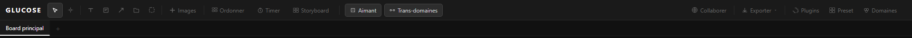

### 3.1 La Toolbar (`Toolbar.tsx`)

- **Dimensions** : `height: 44px`, `width: 100%`, `padding: 0 12px`, `flexShrink: 0`.
- **Fond & Bordure** : `background: #1a1a1a`, `borderBottom: 1px solid #2a2a2a`.
- **Scroll horizontal fluide** : `overflowX: auto`, scrollbar masquée (`display: none`), aucun bouton ne se compresse (`flexShrink: 0`).
- **Logo** :
  - Texte : `Glucose` (ou `GLUCOSE`)
  - Typographie : `font-size: 14px`, `font-weight: 700`, `letter-spacing: 2px`, `color: #ffffff`, `text-transform: uppercase`, `margin-right: 12px`.
- **Séparateur vertical (`sep`)** :
  - `width: 1px`, `height: 20px`, `background: #2a2a2a`, `margin: 0 4px`.
- **Bouton d'Outil Carré (`ToolBtn`)** :
  - `width: 30px`, `height: 30px`, `border-radius: 4px`, `border: none`.
  - Inactif : `background: transparent`, `color: #666666`.
  - Actif : `background: #2d2d2d`, `color: #ffffff`, `outline: 1px solid #444444`.
  - Icônes vectorielles : SVG 12×12 ou 13×13, trait de `1.3px` à `1.5px`.
- **Bouton d'Action Rectangulaire (`ActionBtn`)** :
  - `padding: 4px 10px`, `gap: 5px`, `border-radius: 4px`, `border: none`, `font-size: 12px`.
  - Inactif : `background: transparent`, `color: #666666`.
  - Hover : `background: #1e1e1e`, `color: #cccccc`.
  - Actif : `background: #2d2d2d`, `color: #cccccc`, `outline: 1px solid #444444`.
- **Indicateur Collaboratif** :
  - Pastille verte sur l'icône de globe quand actif : `width: 6px`, `height: 6px`, `border-radius: 50%`, `background: #10b981`, `box-shadow: 0 0 5px #10b981`.

### 3.2 La Barre d'Onglets (`BoardTabs.tsx`)

- **Dimensions** : `height: 34px`, `background: #111111`, `border-bottom: 1px solid #222222`.
- **Comportement des Onglets** :
  - `min-width: 100px`, `max-width: 180px`, `padding: 0 12px`, `font-size: 12px`, `gap: 6px`.
  - Onglet inactif : `background: transparent`, `color: #555555`, `border-bottom: 2px solid transparent`, `border-right: 1px solid #1a1a1a`.
  - Onglet actif : `background: #1a1a1a`, `color: #ffffff`, `border-bottom: 2px solid #ffffff`.
  - Onglet survolé / cible de drag : `background: #1e1e1e`, `border-bottom: 2px solid #555555`.
  - Pastille de Preset dans l'onglet : `font-size: 9px`, `padding: 1px 5px`, `border-radius: 8px`, `background: #2a2a2a`, `color: #666666`.
  - Bouton Fermer `×` : rond 14×14px, `color: #444444`, hover `#333333` / `#aaaaaa`.
  - Bouton Nouveau Board `+` : `width: 34px`, `font-size: 16px`, `color: #444444`, hover `#aaaaaa`.

---

## 4. Système de Tiroirs & Docks (`PanelDock.tsx`)

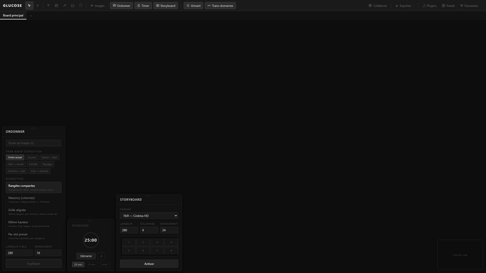

Les panneaux secondaires ne flottent pas au hasard : ils sont ancrés dans deux docks rétractables situés aux coins gauches de l'écran :

```
[ANCRAGE TOP-LEFT] (top: 8px, left: 8px)
  - Domaines (320px)
  - Presets (280px)
  - Plugins IA (340px)
  Geste : Descend du haut comme un tiroir.
  Poignée '⠿⠿' : Située en BAS du panneau.
  Fermeture : Glisser vers le haut (dy * -1 > 80px).

[ANCRAGE BOTTOM-LEFT] (bottom: 8px, left: 8px)
  - Ordonner (250px)
  - Storyboard (260px)
  - Pomodoro Timer (min 160px)
  Geste : Monte du bas.
  Poignée '⠿⠿' : Située en HAUT du panneau.
  Fermeture : Glisser vers le bas (dy * 1 > 80px).
```

### 4.1 Géométrie & Poignée de Préhension
- **Poignée Braille** :
  - Hauteur : `14px`, `position: absolute`, largeur 100%.
  - Texte : `⠿⠿` (points braille U+283F U+283F).
  - Typographie : `font-size: 9px`, `letter-spacing: 3px`, `color: #333333` (normal) ou `#888888` (glissé).
  - Curseur : `cursor: grab` (inactif), `cursor: grabbing` (actif).
- **Ombres & Élévation du Panneau** :
  - Au repos : `box-shadow: 0 4px 20px rgba(0, 0, 0, 0.5)`.
  - En cours de drag : `box-shadow: 0 16px 48px rgba(0, 0, 0, 0.9), 0 0 0 1px #555555`.
- **Physique d'Animation** :
  - Entrée avec ressort : `transform: translateY(0) scale(1)` via `cubic-bezier(0.34, 1.56, 0.64, 1)` sur `220ms`.
  - Sortie (Dismiss) : `transform: translateY(±48px) scale(0.88)`, `opacity: 0` via `cubic-bezier(0.4, 0, 1, 1)` sur `200ms`.
  - Réordonnancement FLIP : `transition: transform 0.25s cubic-bezier(0.22, 1, 0.36, 1)`.

---

## 5. Spécification Détaillée de Tous les Panneaux

### 5.1 Panneau Ordonner (`OrganizePanel.tsx`)

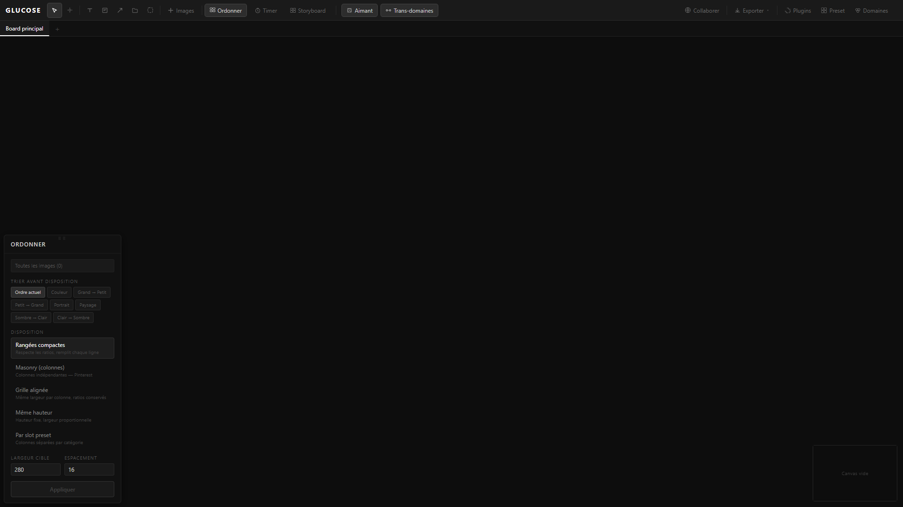

```
+---------------------------------------+
| ORDONNER                              | <- Header (pad 10x14, border #1e1e1e)
+---------------------------------------+
| [ Toutes les images (12)            ] | <- Pill cible (bg #1a1a1a, border #222)
|                                       |
| TRIER AVANT DISPOSITION               | <- Label (font 10, uppercase, #555)
| [Ordre actuel] [Couleur] [Grand->P.]  | <- Boutons pills (pad 3x8, r:3)
| [Petit->Grand] [Portrait] [Paysage]   |
|                                       |
| DISPOSITION                           |
| .-----------------------------------. |
| | Rangées compactes                 | | <- Option active (bg #1e1e1e, b: #333)
| | Respecte les ratios, remplit ...  | |
| '-----------------------------------' |
|   Masonry (colonnes)                  |
|   Grille alignée                      |
|                                       |
| LARGEUR CIBLE        ESPACEMENT       |
| [ 250              ] [ 10           ] | <- Inputs (pad 3x7, bg #1a1a1a, b: #2a2a2a)
|                                       |
| [               Appliquer           ] | <- Bouton action (bg #222, b: #333, text #ccc)
+---------------------------------------+
```
- **Largeur** : `250px`.
- **Fond** : `#111111`, bordure `1px solid #222222`, coins arrondis `6px`.
- **Target pill** : si sélection > 0 : fond sombre doré `#1a1800`, bordure `#3a3000`, texte `#aa9900`.

---

### 5.2 Panneau Pomodoro (`PomodoroTimer.tsx` & `PomodoroOverlay.tsx`)

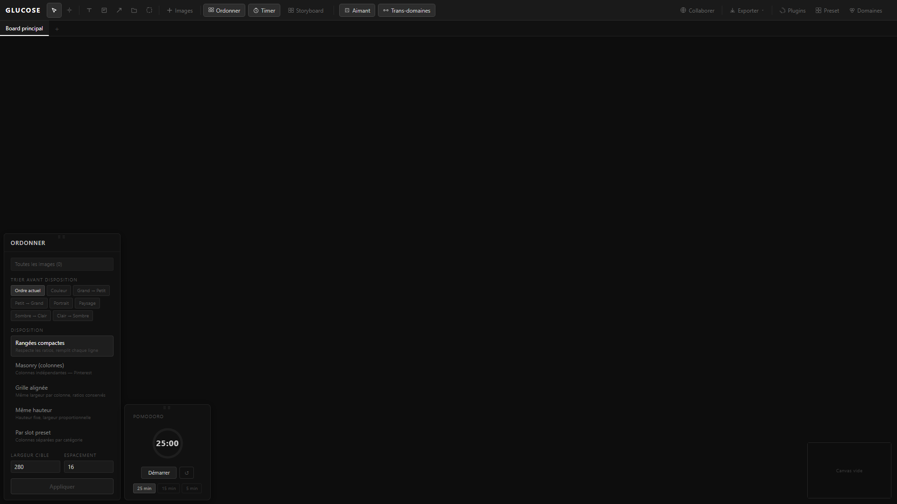

```
+-----------------------------------+
| POMODORO                          |
|                                   |
|             .---.                 |
|            /     \                | <- Anneau SVG 80x80px
|           | 25:00 |               |    Piste: stroke #1e1e1e (w: 5)
|            \     /                |    Arc:   stroke #60a5fa (w: 5, r: 30)
|             '---'                 |    Texte: 17px/22px bold tabular-nums
|                                   |
|      [ Démarrer ]  [ ↺ ]          | <- Actions (pad 4x14, bg #1e1e1e)
|                                   |
|   [ 25 min ] [ 15 min ] [ 5 min ] | <- Presets rapides (pad 2x8, font 10)
+-----------------------------------+
```
- **Dimensions** : `min-width: 160px`, `padding: 18px 18px 14px 18px`.
- **Couleur de fin** : Vert émeraude `#4ade80` (remplace le bleu `#60a5fa`).
- **Overlay Flottant (`PomodoroOverlay.tsx`)** :
  - Visible en haut au centre de l'écran quand le timer tourne : `top: 10px, left: 50%, transform: translateX(-50%)`.
  - Style : Pilule arrondie `border-radius: 20px`, `padding: 3px 12px`, `background: rgba(13, 13, 13, 0.75)`, `backdrop-filter: blur(6px)`.
  - Bordure : `1px solid #60a5fa` (en cours) ou `1px solid #4ade80` (terminé).

---

### 5.3 Panneau Storyboard (`StoryboardControls.tsx`)

```
+-----------------------------------------+
| STORYBOARD                              |
+-----------------------------------------+
| FORMAT                                  |
| [ 16:9 — Cinéma HD                    v ] <- Select native dark
|                                         |
| LARGEUR       COLONNES      ESPACEMENT  |
| [ 280       ] [ 4         ] [ 24      ] | <- Grille 3 colonnes
|                                         |
| .-------------------------------------. |
| | [ 1 ] [ 2 ] [ 3 ] [ 4 ]             | | <- Miniature SVG temps réel
| | [ 5 ] [ 6 ] [ 7 ] [ 8 ]             | |    (fond #0d0d0d, cadres fins)
| '-------------------------------------' |
|                                         |
| [       Mettre à jour       ]  [ ✕ ]    | <- Bouton activer/maj + désactiver
|                                         |
| PANELS (8)                    [+Ajouter]|
| 1  Plan large d'introduction            | <- Liste avec renumérotation
| 2  Gros plan visage protagoniste        |
+-----------------------------------------+
```
- **Largeur** : `260px`, `max-height: 80vh`.
- **Ratios supportés** : `16:9` (1.777), `4:3` (1.333), `2.35:1` (2.35), `1:1` (1.0), `9:16` (0.562).

---

### 5.4 Panneau Domaines Sémantiques (`DomainsPanel.tsx`)

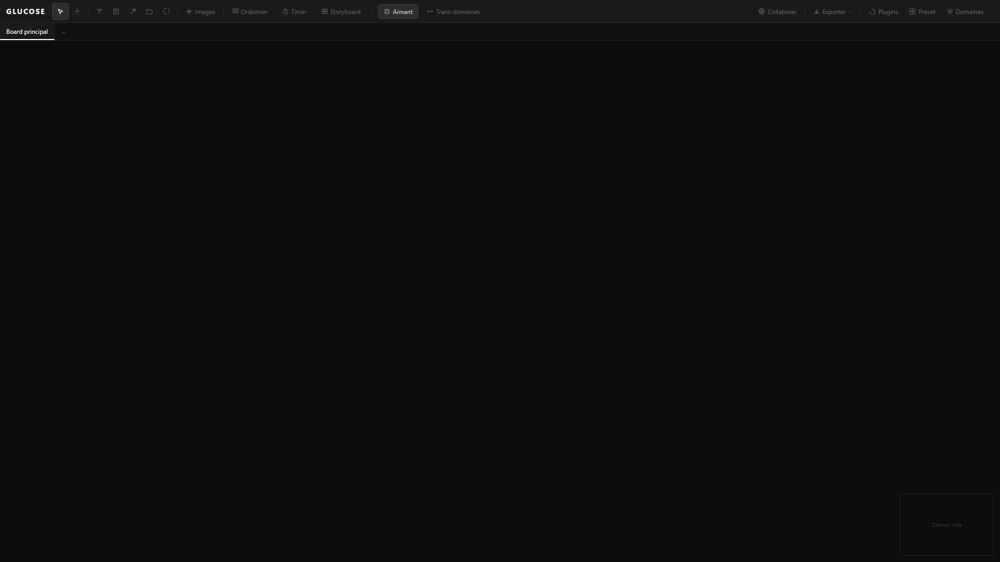

```
+-----------------------------------------+
| DOMAINES                                |
+-----------------------------------------+
| 3 nœuds sélectionnés — clique pour ...  | <- Ruban info sélection
|                                         |
| .-------------------------------------. |
| | 🔬  Biochimie               [✎] [×] | | <- Carte domaine (border #60a5fa33)
| | (---O------------------------)  25% | | <- Slider d'accentuation (accentColor)
| '-------------------------------------' |
|                                         |
| .-------------------------------------. |
| | 🎨  Design Graphique        [✎] [×] | |
| | [■][■][■][■][■][■][■][■]            | | <- Palette en mode édition
| '-------------------------------------' |
|                                         |
| [          + Nouveau domaine          ] | <- Bouton pointillé (border 1px dashed)
+-----------------------------------------+
```
- **Largeur** : `320px`, tiroir haut-gauche (`max-height: 70vh`).
- **8 Couleurs Normalisées** :
  `#60a5fa` (Bleu), `#34d399` (Émeraude), `#f472b6` (Rose), `#fbbf24` (Ambre),
  `#a78bfa` (Violet), `#f87171` (Rouge), `#22d3ee` (Cyan), `#fb923c` (Orange).
- **12 Icônes Normalisées** : `🔬`, `🎨`, `🎮`, `📚`, `🌍`, `⚛`, `✦`, `♪`, `△`, `○`, `✿`, `❀`.

---

### 5.5 Panneau Presets Artistiques (`PresetPanel.tsx`)

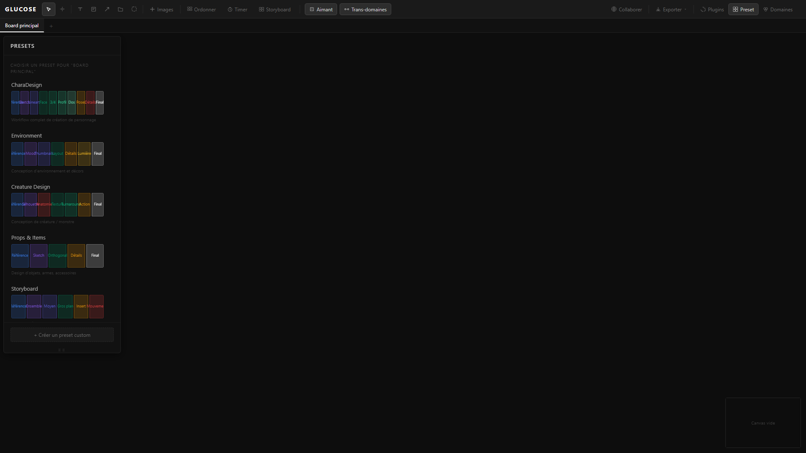

- **Largeur** : `280px`, tiroir haut-gauche.
- **Miniature SVG de Layout (`PresetThumb`)** :
  - Dimensions : `220px × 56px`.
  - Rendu vectoriel : chaque slot est un rectangle `rx: 2`, `fill: slot.color (18% alpha)`, `stroke: slot.color (45% alpha)`.
  - Titre au centre du slot en police 9px.
- **Liste des Slots du Board Actif** :
  - Pastilles avec indicateur : `✓ Nom` (slot rempli) ou `○ Nom` (slot vacant).

---

### 5.5b Panneau Plugins & Modèles IA (`PluginsPanel.tsx`)

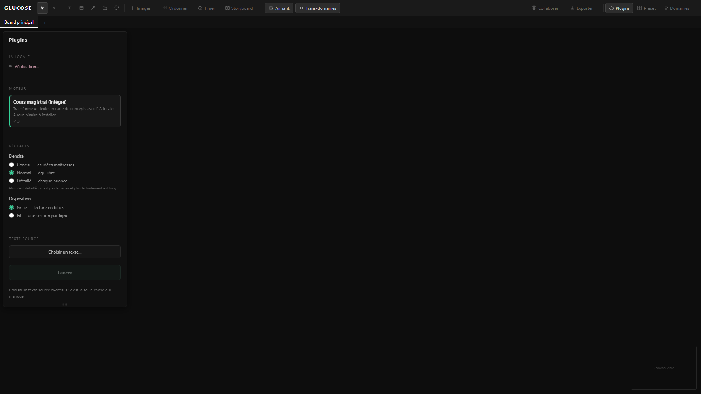

- **Largeur** : `340px`, tiroir haut-gauche.
- **Gestionnaire d'IA locale** :
  - Détection automatique de l'accélération matérielle (WebGPU, Wasm SIMD).
  - Statut de téléchargement des poids de modèles de vision (CLIP, MobileNet, embedder sémantique).
  - Cartes avec bordure `#222222` et badge de disponibilité.

---

### 5.6 Panneau Collaboration Multijoueur (`MultiplayerPanel.tsx`)

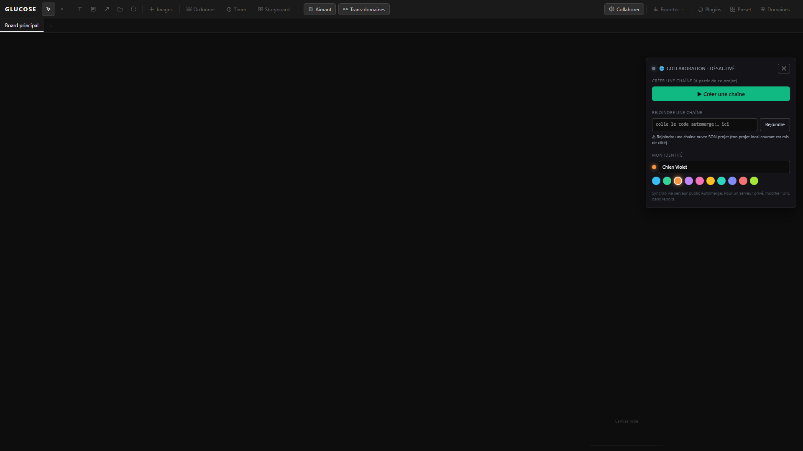

```
+-----------------------------------------+
| 🌐 COLLABORATION · CONNECTÉ AU SERVEUR  | <- Header avec pastille verte #10b981
+-----------------------------------------+
| CODE DE LA CHAÎNE (à envoyer à ton pote)|
| [ automerge:28f9a...          ] [Copier]| <- Code vert émeraude #10b981
|                                         |
| Chaîne active. Vous éditez à deux ...   |
| [          Quitter la chaîne          ] | <- Bouton danger (bg #ef444414, text #f87171)
|                                         |
| MON IDENTITÉ                            |
| (●) [ Alice                         ]   | <- Pastille couleur perso + pseudo
| (●) (●) (●) (●) (●) (●) (●) (●)         | <- Swatches ronds 20x20px
+-----------------------------------------+
```
- **Largeur** : `360px`, `top: 60px, right: 16px`, fond `rgba(20, 20, 24, 0.96)`.

---

### 5.7 Panneau Time Machine & Réglette Temporelle (`TimelinePanel.tsx`)

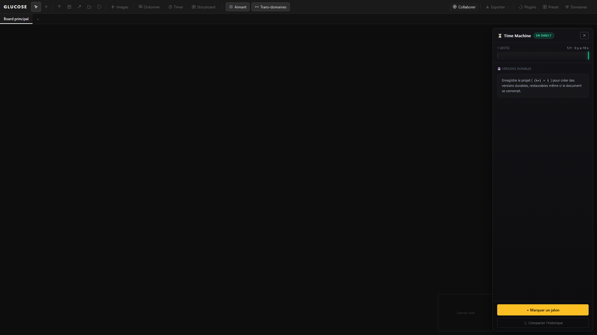

```
+-------------------------------------------------------------+
| ⏳ Time Machine                        [ APERÇU ]       [✕] | <- Header avec badge ambre
+-------------------------------------------------------------+
| 14 GESTES                           14/14 · il y a 2 min    |
| .---------------------------------------------------------. |
| | | | | | | | | | | | | | | | | | | | | | | | | | |[|]    | | <- Track de scrub avec ticks
| '---------------------------------------------------------' |    (curseur ambre ou vert)
| [ ← Maintenant ]  [ ⏪ Restaurer cet état                 ] |
+-------------------------------------------------------------+
| 💾 VERSIONS DURABLES                                        |
|                                                             |
|   (●)  Refonte architecturale                   [↩ Restaurer| <- Nœud d'arbre (commit git)
|    |   [MANUEL]  il y a 12 min                              |
|    |                                                        |
|   (●)  Sauvegarde automatique                   [↩ Restaurer|
|        [AUTO]    il y a 1 h                                 |
+-------------------------------------------------------------+
| [                  + Marquer un jalon                     ] | <- Bouton primaire ambre #fbbf24
| [               🗜️ Compacter l'historique                  ] |
+-------------------------------------------------------------+
```
- **Largeur** : `324px`, positionné à `top: 12, right: 12, bottom: 12`.
- **Liseré Ambre Plein Écran (Mode Aperçu)** :
  - `position: fixed, inset: 0, pointer-events: none`.
  - `border: 3px solid #fbbf24`.
  - `box-shadow: inset 0 0 60px rgba(251, 191, 36, 0.18)`.

#### Réglette Temporelle Bas d'Écran (`TemporalRuler.tsx`)

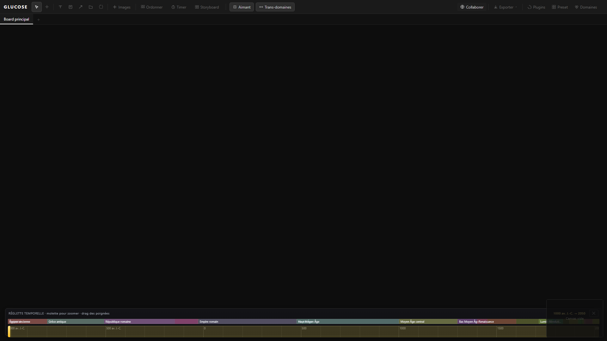

- **Réglette Temporelle Bas d'Écran** :
  - `height: 88px, bottom: 16px, left: 16px, right: 16px`.
  - Fond sombre dégradé avec flou `backdrop-filter: blur(6px)`.
  - Piste principale avec ticks d'années et étiquettes textuelles.
  - Fenêtre sélectionnée : fond ambre `rgba(253, 224, 71, 0.16)`.
  - Poignées de redimensionnement de l'intervalle : dégradé `linear-gradient(180deg, #fde68a, #fbbf24)`, halo `0 0 6px rgba(253,224,71,0.4)`.

---

### 5.8 Panneau de Recherche Globale (`SearchPanel.tsx`)

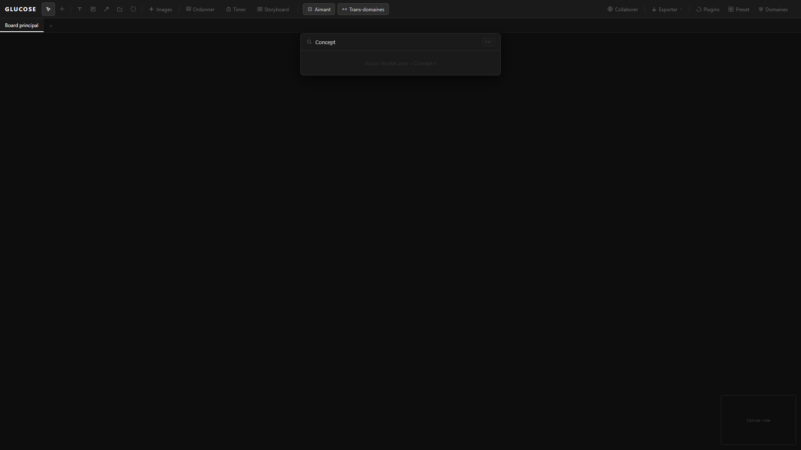

- **Position & Dimensions** : `position: fixed, top: 80px, left: 50%, transform: translateX(-50%)`, `width: 480px`, `max-width: 90vw`.
- **Fond & Ombre** : `background: #1a1a1a`, `border: 1px solid #333333`, `box-shadow: 0 8px 32px rgba(0,0,0,0.6)`, `border-radius: 8px`.
- **Icônes par type** : `☰` Board, `▣` Image, `T` Texte, `N` Note sticky.
- **Raccourci de fermeture** : Badge `<kbd>Esc</kbd>` (`border: 1px solid #2a2a2a, font-size: 10px`).

---

### 5.9 HUD Télémétrique & Diagnostic (`DiagnosticsHUD.tsx`)

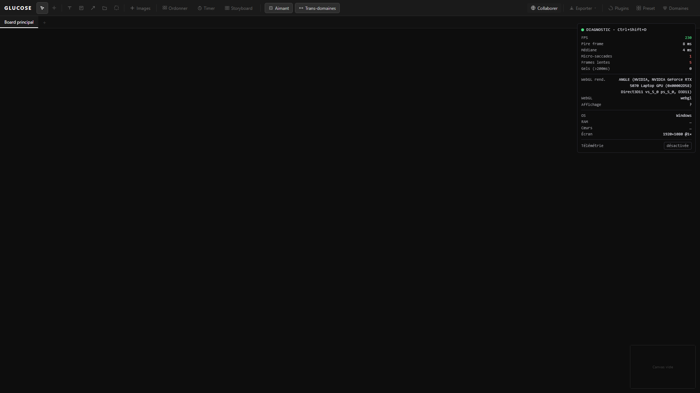

- **Raccourci d'ouverture** : `Ctrl+Shift+D`.
- **Position & Style** : `fixed, top: 64px, right: 12px, z-index: 2000`, `background: #0d0d0dee`, `border: 1px solid #26262e`, `border-radius: 6px`, `padding: 8px 10px`.
- **Typographie** : `font: 11px/1.55 ui-monospace, SFMono-Regular, Menlo, monospace`.
- **Indicateur de statut** : Rond 8×8px, vert `#4ade80` (60 FPS fluide) ou rouge `#f87171` (chute de FPS / lag / pilote logiciel).

---

## 6. Éléments du Canvas : Barres d'Options Flottantes

### 6.1 Options de Membrane (`MembraneOptions.tsx`)

- **Position** : `position: absolute, bottom: 48px, left: 50%, transform: translateX(-50%)`.
- **Style** : `background: #111111`, `border: 1px solid #2a2a2a`, `border-radius: 6px`, `padding: 8px 12px`, `box-shadow: 0 4px 20px rgba(0,0,0,0.7)`.
- **Boutons de Mode** :
  - `Classique` | `Minimisée` | `Étirée`
  - Bouton actif : `background: #2d2d2d, border: 1px solid #555555, color: #cccccc`.
  - Bouton désactivé (aller sans retour) : `color: #3a3a3a, border: 1px solid #242424, cursor: not-allowed`.
- **Bouton Rideau** : Crée un espace de travail collaboratif personnel rattaché à la membrane.

### 6.2 Options de Flèche (`ArrowOptions.tsx`)

- **Position** : Identique (`bottom: 48px, left: 50%`).
- **Options de style** : `Droite` | `Courbe`, `⇄` (bidirectionnel), épaisseurs `1`, `2`, `3`, `5`.
- **6 Prédicats Sémantiques Normalisés** :
  - `→ précurseur` : `#f59e0b` (Ambre)
  - `✗ contredit` : `#ef4444` (Rouge)
  - `⊂ hérite` : `#8b5cf6` (Violet)
  - `✦ inspire` : `#10b981` (Émeraude)
  - `⊕ dépend` : `#3b82f6` (Bleu)
  - `◎ illustre` : `#f472b6` (Rose)

---

## 7. Rendu Visuel des Nœuds du Canvas

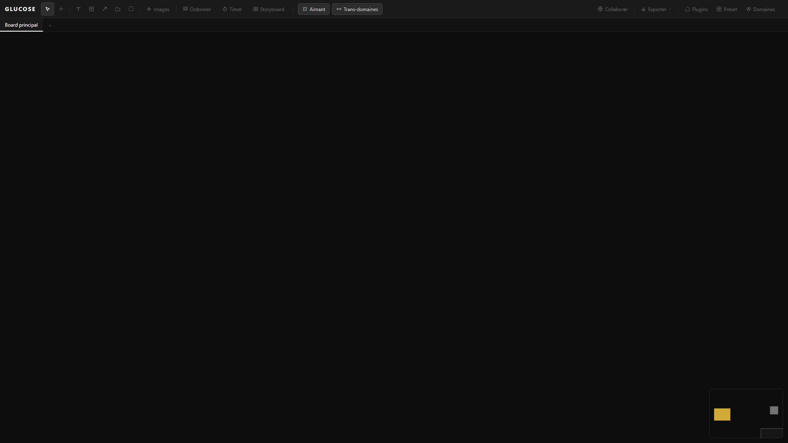

### 7.1 Cartes de Texte & Nuages Markdown

- **Rayon de Courbure** : `border-radius: 32px` (forme de galet doux).
- **Padding** : `16px 24px`.
- **Effet de Brume & Aura Lumineuse** :
  - Couleur calculée via l'algorithme de **symbiose chromatique** (`auraColor`).
  - Fond brumeux : `background: color-mix(in srgb, ${auraColor} 3%, transparent)`.
  - Halo diffus : `box-shadow: 0 0 60px 30px color-mix(in srgb, ${auraColor} 15%, transparent)`.
  - En survol / prévisualisation : `box-shadow: 0 0 80px 40px color-mix(in srgb, ${auraColor} 40%, transparent)`.
- **Sélection active** : Contour pointillé fin `1px dashed rgba(255, 255, 255, 0.5)` avec `outline-offset: 4px`.

### 7.2 Notes Sticky & Opérateurs Logiques

- **Sticky Standard** :
  - Dimensions par défaut : `160px × 120px`.
  - Fond par défaut : Jaune post-it `#f5c542`.
  - Bande supérieure collante : `height: 16px`, `background: rgba(255, 255, 255, 0.15)`.
  - Poignées de coin : 4 carrés de `8×8px` blancs avec contour noir `1px solid #333333`.
- **Pilules d'Opérateurs Logiques (`ann.operator`)** :
  - `height: 44px`, `border-radius: 22px`.
  - Largeur : `80px` (`ET`, `OU`, `MAIS`) ou `130px` (`PARCE QUE`).
  - Fond : `${color}20` (12% opacité).
  - Bordure : `1.5px solid ${color}`.
  - Halo lumineux : `box-shadow: 0 0 18px ${color}33` (normal) ou `0 0 0 2px #fff, 0 0 18px ${color}55` (sélectionné).
  - Typographie : `font-size: 13px, font-weight: 700, letter-spacing: 1px, text-transform: uppercase`.

---

## 8. Tableau Synthétique pour le Rendu Rust Natif

Pour implémenter ces composants dans un moteur de rasterisation purement logiciel en Rust (framebuffer pixel RGBA8) :

| Composant | Largeur | Hauteur | Fond (RGBA) | Bordure | Coins (R) | Ombres & Spécificités |
| :--- | :--- | :--- | :--- | :--- | :--- | :--- |
| **Toolbar** | 100% | 44 px | `(26, 26, 26, 255)` | Bas `1px (42, 42, 42)` | 0 | Logo blanc 14px bold, gap 2px |
| **ToolBtn** | 30 px | 30 px | Actif `(45, 45, 45, 255)` | Actif `1px (68, 68, 68)` | 4 px | Icônes centrées 12-14px |
| **BoardTabs** | 100% | 34 px | `(17, 17, 17, 255)` | Bas `1px (34, 34, 34)` | 0 | Onglet actif souligné de 2px blanc |
| **PanelDock Grip**| 100% | 14 px | Transparent | Aucune | 6 px | Glyphe `⠿⠿` 9px centré |
| **OrganizePanel**| 250 px | Auto | `(17, 17, 17, 255)` | `1px (34, 34, 34)` | 6 px | `box-shadow 0 4px 20px rgba(0,0,0,0.5)` |
| **Pomodoro** | 160 px | Auto | `(17, 17, 17, 255)` | `1px (34, 34, 34)` | 8 px | Cercle $R=30$ px, épaisseur 5px |
| **Storyboard** | 260 px | Max 80vh | `(17, 17, 17, 255)` | `1px (34, 34, 34)` | 6 px | Miniature grille vectorielle |
| **DomainsPanel** | 320 px | Max 70vh | `(17, 17, 17, 255)` | `1px (34, 34, 34)` | 6 px | Cartes avec liseré couleur à 20% alpha |
| **TimelinePanel**| 324 px | 100% - 24px | `(20, 20, 24, 247)` | `1px (42, 42, 42)` | 10 px | Scrubber ambre/gris + arbre vertical |
| **TemporalRuler**| 100% - 32px | 88 px | `(20, 20, 24, 235)` | `1px (42, 42, 42)` | 8 px | Poignées dégradé doré `#fbbf24` |
| **Text Cloud** | Auto / Max 600| Auto | Teinte symbiotique 3% | Pointillé blanc si sel | 32 px | Halo gaussien étendu 60px à 15% alpha |
| **Sticky Op** | 80 / 130 px | 44 px | Couleur opérateur 12% | `1.5px` couleur op | 22 px | Halo néon 18px à 20% alpha |
| **Minimap** | 180 px | 120 px | `(13, 13, 13, 235)` | `1px (42, 42, 42)` | 4 px | Rendu proportionnel réduit + crosshair |
