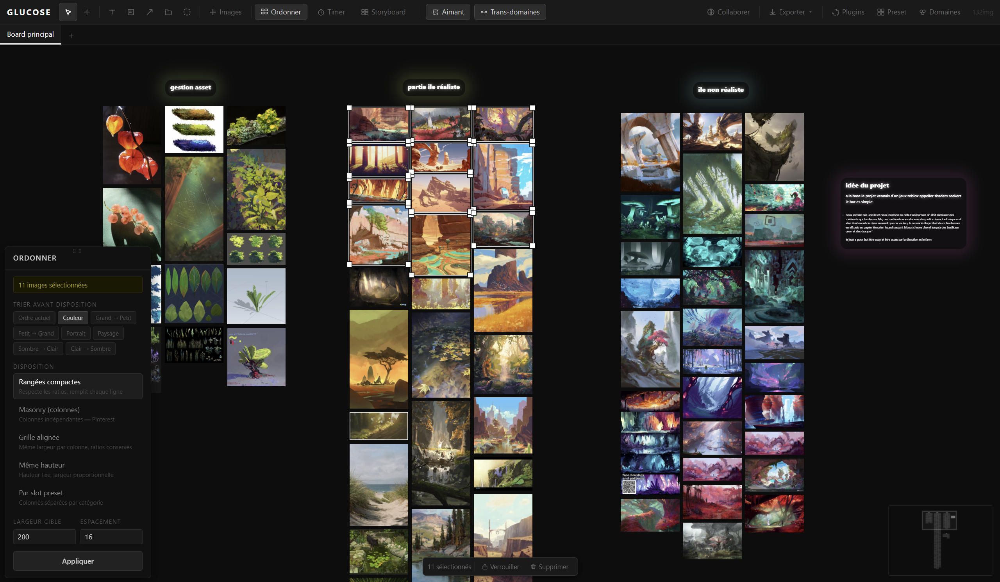

# 10 — SPÉCIFICATION VISUELLE EXHAUSTIVE DES PANNEAUX ET DE L'INTERFACE (UI GLUCOSE)

Ce document établit la **référence visuelle absolue, au pixel et au code hexadécimal près**, de l'ensemble de l'interface graphique de Glucose (version TypeScript/Tauri de référence). Il est destiné à guider la réécriture en **Rust natif** afin de garantir une **parité visuelle à 100 %**.

> **Méthode (12/09/2026)** : chaque valeur est allée voir le code, puis la référence quand ils divergeaient. Ce qui est tenu par un test est sorti ; ce qui reste est la liste de travail. Six panneaux sur dix existent (Ordonner, Pomodoro, Storyboard, Domaines, Presets, Plugins) ; Storyboard et Plugins sont des façades honnêtes (fiche 09 § 8, § 10) ; Collaboration, Time Machine, Recherche, HUD et les barres flottantes n'existent pas. Là où les fiches 06 et 10 se contredisaient (fond des panneaux `#161616` / `#111111`), la référence a tranché : `#111`.

---

## 1. Principes Directeurs & Charte Brutaliste

> Tenus : chrome 100 % monochrome (`test_every_chrome_token_is_a_neutral_grey`), découplage écran / monde des panneaux, barres, minimap et poignées (`WorldScale::screen`, SCALE-1). La couleur n'appartient qu'au contenu — ce que la liste ci-dessous précise, et que le thème respecte : les seules couleurs de la chrome sont le jaune d'emphase (réservé), le vert de succès (fin d'un Pomodoro) et le rouge d'alerte.
>
> *Jaune / Ambre (`#fbbf24`, `#f59e0b`, `#fde68a`)* : stickies, temporalité, jalons Time Machine, opérateur « MAIS ». *Émeraude / Vert (`#10b981`, `#34d399`, `#4ade80`)* : collaboration, opérateur « ET », validation Pomodoro. *Rouge (`#ef4444`, `#f87171`)* : verrous, liens rompus, « CONTREDIT », obstacles. *Bleu (`#60a5fa`, `#93c5fd`)* : focus clavier, opérateur « OU », description des flèches. *Violet (`#a78bfa`, `#8b5cf6`)* : « PARCE QUE », « hérite ».

```
+---------------------------------------------------------------------------------------------------------+
| [GLUCOSE]  [V] [Espace] | [T] [N] [A] [F] [M] | [+Img] | [Ordonner] [Timer] [Storyboard] | [Collab] [Export]    | <- Toolbar (44px)
+---------------------------------------------------------------------------------------------------------+
| [ Board 1         x ] [ Board 2         x ] [ + ]                                                       | <- BoardTabs (34px)
+---------------------------------------------------------------------------------------------------------+
| [Top-Left Dock]                                                                         [Time Machine]  |
| .-------------------------.                                                             | (324px)     | |
| | Domaines / Plugins      |                                                             | Commit tree | |
| '-------------------------'                                                             | Scrubber    | |
|                                             CANVAS INFINI                               |             | |
|                                          (Grille de points)                             |             | |
|                                                                                         |             | |
| [Bottom-Left Dock]                                                                      |             | |
| .----------------. .------------.                                                       |             | |
| | Ordonner (250) | | Timer (80) |                                                       |             | |
| '----------------' '------------'                                                       |             | |
|                                                                                         |             | |
| [============= Réglette Temporelle (88px) =============]             [ Minimap (180x120) ]             |
+---------------------------------------------------------------------------------------------------------+
```

### 1.1 Galerie des Captures d'Écran Réelles de Référence

> **Toutes les captures ci-dessous sont 100 % authentiques**, issues de sessions réelles sur Glucose. **Aucune image n'est générée par IA.** Elles sont la cible visuelle ; elles ne se vérifient pas ligne à ligne mais à l'œil, capture contre capture, une fois les panneaux écrits.

| Réf | Fichier Réel | Description & Éléments Observés |
| :--- | :--- | :--- |
| **00** | [`00_user_production_board.png`](screens/00_user_production_board.png) | **Étalon d'Or — Session de Production Réelle** : 132 images, capsules de titre lumineuses, note `idée du projet` avec aura violette, multi-sélection de 11 images, barre flottante `11 sélectionnés`, panneau Ordonner, minimap. |
| **01** | [`01_canvas_default.png`](screens/01_canvas_default.png) | **Canvas Initial Épuré** : fond `#0d0d0d`, grille de points, toolbar 44px, onglets 34px, minimap 180×120. |
| **02** | [`02_toolbar_tabs_crop.png`](screens/02_toolbar_tabs_crop.png) | **Chrome Supérieur** : logo 14px bold, boutons 30×30px, onglet actif liseré blanc 2px. |
| **03** | [`03_panel_organize_full.png`](screens/03_panel_organize_full.png) | **Panneau Ordonner (250px)** : pilule de sélection, tri, modes, inputs. |
| **04** | [`04_dock_organize_pomodoro.png`](screens/04_dock_organize_pomodoro.png) | **Dock Ordonner + Pomodoro** : anneau 80×80px, tabular-nums, boutons 25/15/5m. |
| **05** | [`05_dock_three_panels.png`](screens/05_dock_three_panels.png) | **Dock Triple** : alignement horizontal, poignées `⠿⠿`, miniature de layout. |
| **06** | [`06_drawer_domains.png`](screens/06_drawer_domains.png) | **Tiroir Domaines (320px)** : cartes à liseré coloré, curseur d'intensité. |
| **07** | [`07_drawer_presets.png`](screens/07_drawer_presets.png) | **Tiroir Presets (280px)** : miniatures vectorielles des grilles. |
| **08** | [`08_drawer_plugins.png`](screens/08_drawer_plugins.png) | **Tiroir Plugins & IA Locale (340px)**. |
| **09** | [`09_panel_multiplayer.png`](screens/09_panel_multiplayer.png) | **Panneau Collaborer (360px)**. |
| **10** | [`10_search_modal.png`](screens/10_search_modal.png) | **Recherche Modale (480px, Ctrl+F)**. |
| **11** | [`11_timemachine_drawer.png`](screens/11_timemachine_drawer.png) | **Time Machine (324px, Ctrl+H)**. |
| **12** | [`12_temporal_ruler.png`](screens/12_temporal_ruler.png) | **Réglette Temporelle (88px, Shift+R)**. |
| **13** | [`13_diagnostics_hud.png`](screens/13_diagnostics_hud.png) | **Diagnostics HUD (Ctrl+Shift+D)**. |
| **14** | [`14_canvas_with_live_elements.png`](screens/14_canvas_with_live_elements.png) | **Nœuds réels** : sticky `#f5c542`, pilule `ET` néon vert, carte texte, sélection. |

### 1.2 Décomposition de l'Étalon de Production



> Tenus : capsules et cartes (padding `16px 24px`, coins 32 px — fiche 06 § 5.1) ; cadre de sélection blanc à 0,80 débordant de 3 px en 1,25 px ; poignées 9 × 9 blanches à liseré `#111111` (fiche 06 § 4.2) ; panneau Ordonner de 250 px sur fond `#111111` bordé `#222222`.

* **À FAIRE** — **Barre flottante de sélection contextuelle** : centrée à `bottom: 12px`, fond `#1a1a1a`, bordure `#333333`, rayon 6 px, ombre `0 2px 12px rgba(0,0,0,0.5)`, padding `4px 8px` ; compteur `11 sélectionnés` avec séparateur `#2a2a2a` ; action **Verrouiller** (cadenas ; `Verrouillé` sur fond `#2a1a1a`, texte `#f87171`) ; action **Supprimer**.
* **À FAIRE** — **Pastille de cible dorée** du panneau Ordonner quand la sélection n'est pas vide : fond `#1a1800`, bordure `#3a3000`, texte `#aa9900` — l'usage légitime de l'emphase. Le compteur est aujourd'hui en blanc.
* **À VÉRIFIER** — Les 8 boutons de tri (`Ordre actuel`, `Couleur`, `Grand → Petit`, `Petit → Grand`, `Portrait`, `Paysage`, `Sombre → Clair`, `Clair → Sombre`) et les 5 modes (`Rangées compactes`, `Masonry`, `Grille alignée`, `Même hauteur`, `Par slot preset`) avec leurs descriptions ; champs `LARGEUR CIBLE` / `ESPACEMENT` ; bouton `Appliquer` (`#222` / `#ccc`). Le panneau existe et applique bien une disposition (`apply_dock_layout`, tests) ; la liste exacte reste à confronter.
* **À FAIRE** — Compteur d'images `132img` à l'extrême droite de la toolbar, 11 px `#3a3a3a`.

---

## 3. Chrome Supérieur : Toolbar & BoardTabs

> Tenus (`test_the_chrome_metrics_are_those_of_the_spec`, thème) : toolbar 44 px `#1a1a1a` bordure `#2a2a2a` ; boutons d'outil 30 × 30, actif `#2d2d2d` / `#ffffff` / contour `#444444`, inactif `#666666` ; onglets 34 px `#111111`, actif `#1a1a1a` / `#ffffff` souligné de 2 px blanc ; toasts (fiche 06 § 10.3).

* **À VÉRIFIER** — Logo `GLUCOSE` 14 px 700 espacé de 2 px, marge droite 12 ; séparateurs 1 × 20 `#2a2a2a` marges 4 ; boutons d'action padding `4px 10px`, 12 px, survol `#1e1e1e` / `#cccccc`, actif `#2d2d2d` / `#cccccc` / `#444444` ; scroll horizontal sans compression.
* **À VÉRIFIER** — Onglets : `min-width 100`, `max-width 180`, padding 12, 12 px, séparateur droit `#1a1a1a`, inactif `#555555`, survol / cible de drag `#1e1e1e` souligné `#555555` ; pastille de preset 9 px `#2a2a2a` / `#666666` ; fermeture `×` 14 px `#444444` (survol `#aaaaaa`) ; `+` 34 px de large, 16 px, `#444444`.
* **À FAIRE** — Pastille verte `#10b981` de 6 px sur le globe quand la collaboration est active (fiche 09 § 9 : rien n'existe).

---

## 4. Système de Tiroirs & Docks (`PanelDock.tsx`)

> Tenus (`test_dock_anchors_and_defaults`, `test_dock_drag_swap_and_dismiss`) : deux docks — Domaines 320, Presets 280, Plugins 340 descendent du haut ; Ordonner 250, Storyboard 260, Pomodoro ≥ 160 montent du bas — ; fermeture au-delà de **80 px** de glissement vers la sortie (le Rust avait 60 ; Storyboard 280, Plugins 320, Domaines 336 sont alignés) ; échange de place par glissement horizontal.

* **À VÉRIFIER** — Ancrage à 8 px des bords ; poignée braille `⠿⠿` de 14 px (9 px, espacement 3, `#333333` / `#888888` glissée), en bas pour le dock du haut, en haut pour celui du bas ; curseurs `grab` / `grabbing`.
* **À FAIRE** — Ombres : repos `0 4px 20px rgba(0, 0, 0, 0.5)`, glissé `0 16px 48px rgba(0, 0, 0, 0.9), 0 0 0 1px #555555`. Le Rust dessine une ombre décalée de 3 px à 0,63 (0,86 glissé).
* **À FAIRE** — Animations : entrée `cubic-bezier(0.34, 1.56, 0.64, 1)` sur 220 ms, sortie `translateY(±48px) scale(0.88)` opacité 0 sur 200 ms, FLIP `0.25s cubic-bezier(0.22, 1, 0.36, 1)` (fiche 07 § 2).

---

## 5. Spécification Détaillée de Tous les Panneaux

### 5.1 Panneau Ordonner (`OrganizePanel.tsx`)
> Existe, branché, testé (`test_organize_layout_generation`, `test_organize_layout_exact_utf8_hit_test`). Voir § 1.2 pour ce qui reste.

### 5.2 Panneau Pomodoro (`PomodoroTimer.tsx` & `PomodoroOverlay.tsx`)
> Existe : anneau, décompte, boutons. L'anneau est **blanc** — la référence le faisait bleu `#60a5fa`, dette que `style.md` avoue ; la loi de la couleur prime — et vert `#4ade80` une fois terminé (jeton `success`).

* **À VÉRIFIER** — Anneau 80 × 80, piste `#1e1e1e` de 5 px, rayon 30 ; temps en 17 px / 22 px gras `tabular-nums` ; actions `Démarrer` / `↺` (padding `4px 14px`, `#1e1e1e`) ; presets `25 min` / `15 min` / `5 min` (padding `2px 8px`, 10 px) ; panneau `min-width 160`, padding `18 18 14 18`, coins 8 px.
* **À FAIRE** — **Overlay flottant** en haut au centre pendant le décompte : pilule `border-radius: 20px`, padding `3px 12px`, `rgba(13, 13, 13, 0.75)`, flou 6 px, bordure blanche (en cours) ou `#4ade80` (terminé).

### 5.3 Panneau Storyboard (`StoryboardControls.tsx`)
> Façade honnête (fiche 09 § 8). Ratios `16:9` 1,777 · `4:3` 1,333 · `2.35:1` · `1:1` · `9:16` 0,562 ; largeur 260 ; `max-height: 80vh` ; miniature vectorielle temps réel ; bouton `Mettre à jour` / `✕` ; liste `PANELS (n)` avec `+ Ajouter` et renumérotation. Tout est **À FAIRE** avec la fonction.

### 5.4 Panneau Domaines Sémantiques (`DomainsPanel.tsx`)
> Existe, branché, testé par la souris (`interactions/domains/tests.rs`, `dock/domains/tests.rs`). Palette des huit couleurs alignée sur la référence (`test_the_domain_palette_is_that_of_the_reference`) : `#60a5fa`, `#34d399`, `#f472b6`, `#fbbf24`, `#a78bfa`, `#f87171`, `#22d3ee`, `#fb923c`.

* **Écart assumé, lié à la typographie** — les 12 icônes de la référence sont des emoji (`🔬`, `🎨`, `🎮`, `📚`, `🌍`, `⚛`, `✦`, `♪`, `△`, `○`, `✿`, `❀`) ; la police embarquée n'a pas ces glyphes, le Rust propose des sigles de trois capitales (`SCI`, `ART`, …). À revoir avec le rendu texte GPU.
* **À VÉRIFIER** — Ruban d'information de sélection ; carte à liseré `couleur33` ; curseur d'accentuation ; palette en mode édition ; bouton `+ Nouveau domaine` en pointillé ; `max-height: 70vh`.

### 5.5 Panneau Presets Artistiques (`PresetPanel.tsx`)
> Existe (280 px, quatre gabarits avec zones colorées).

* **À VÉRIFIER** — Miniature `PresetThumb` 220 × 56 (slots `rx: 2`, remplissage couleur à 18 %, contour à 45 %, titre 9 px) ; liste des slots du board actif `✓ Nom` / `○ Nom` ; et le **branchement** : le noyau sait poser les zones d'un preset (`Store::apply_preset_to_board`, journalisé), mais aucun clic du panneau ne l'appelle (`PanelClickResult::Handled`).

### 5.5b Panneau Plugins & Modèles IA (`PluginsPanel.tsx`)
> Façade honnête (fiche 09 § 10) : « Ollama : non détecté », rien de téléchargé. Détection de l'accélération (WebGPU, Wasm SIMD), statut des poids (CLIP, MobileNet, embedder), cartes bordées `#222222` avec badge : **À FAIRE** avec la fonction.

### 5.6 Panneau Collaboration Multijoueur (`MultiplayerPanel.tsx`)
* **À FAIRE** (fiche 09 § 9) — 360 px, `top: 60px, right: 16px`, `rgba(20, 20, 24, 0.96)` ; en-tête `🌐 COLLABORATION · CONNECTÉ AU SERVEUR` avec pastille `#10b981` ; code de chaîne `automerge:…` en `#10b981` avec `Copier` ; `Quitter la chaîne` (fond `#ef444414`, texte `#f87171`) ; identité : pastille, pseudo, huit swatches ronds de 20 px.

### 5.7 Panneau Time Machine & Réglette Temporelle (`TimelinePanel.tsx`)
* **À FAIRE** (fiche 09 § 2.1, § 3.3 : jalons durables) — 324 px, `top/right/bottom: 12` ; en-tête `⏳ Time Machine` avec badge ambre `APERÇU` ; `n GESTES`, `n/n · il y a …` ; piste de scrub à ticks, curseur ambre ou vert ; `← Maintenant`, `⏪ Restaurer cet état` ; `💾 VERSIONS DURABLES` en arbre (`[MANUEL]` / `[AUTO]`, `↩ Restaurer`) ; `+ Marquer un jalon` (primaire ambre `#fbbf24`), `🗜️ Compacter l'historique` ; en mode aperçu, liseré plein écran `3px solid #fbbf24` avec `inset 0 0 60px rgba(251, 191, 36, 0.18)`.
* **À FAIRE** (fiche 09 § 7.2) — **Réglette temporelle** : `height: 88px`, à 16 px des bords, fond sombre flouté 6 px, ticks d'années et étiquettes, fenêtre sélectionnée `rgba(253, 224, 71, 0.16)`, poignées `linear-gradient(180deg, #fde68a, #fbbf24)` avec halo `0 0 6px rgba(253, 224, 71, 0.4)`.

### 5.8 Panneau de Recherche Globale (`SearchPanel.tsx`)
* **À FAIRE** — `Ctrl+F` : modale à `top: 80px`, centrée, 480 px (`max-width: 90vw`), `#1a1a1a`, bordure `#333333`, ombre `0 8px 32px rgba(0,0,0,0.6)`, rayon 8 ; icônes `☰` Board, `▣` Image, `T` Texte, `N` Note ; badge `Esc` (bordure `#2a2a2a`, 10 px).

### 5.9 HUD Télémétrique & Diagnostic (`DiagnosticsHUD.tsx`)
* **À FAIRE** — `Ctrl+Shift+D` : `top: 64px, right: 12px`, `#0d0d0dee`, bordure `#26262e`, rayon 6, padding `8px 10px`, `11px/1.55 ui-monospace` ; rond de 8 px vert `#4ade80` (60 fps) ou rouge `#f87171`. `perf.rs` instrumente la console sous `GLUCOSE_PERF=1` ; rien à l'écran.

---

## 6. Éléments du Canvas : Barres d'Options Flottantes

### 6.1 Options de Membrane (`MembraneOptions.tsx`)
* **À FAIRE** (fiche 08 § 7.1) — `bottom: 48px`, centrée ; `#111111`, bordure `#2a2a2a`, rayon 6, padding `8px 12px`, ombre `0 4px 20px rgba(0,0,0,0.7)` ; `Classique` | `Minimisée` | `Étirée` (actif `#2d2d2d` / `#555555` / `#cccccc` ; désactivé `#3a3a3a` / `#242424`, `not-allowed`) ; bouton **Rideau**.

### 6.2 Options de Flèche (`ArrowOptions.tsx`)
* **À FAIRE** — Même position ; `Droite` | `Courbe`, `⇄`, épaisseurs `1` `2` `3` `5` ; les six prédicats avec **leur couleur** : `→ précurseur` `#f59e0b`, `✗ contredit` `#ef4444`, `⊂ hérite` `#8b5cf6`, `✦ inspire` `#10b981`, `⊕ dépend` `#3b82f6`, `◎ illustre` `#f472b6` (les prédicats existent dans le modèle, fiche 08 § 4.3 ; ni barre, ni couleur).

---

## 7. Rendu Visuel des Nœuds du Canvas

> Voir la fiche 06 § 5 : cartes (tenu), notes (tenu pour les métriques ; ombre, bande collante `16px` à `rgba(255, 255, 255, 0.15)`, poignées en disques à faire), pilules d'opérateur (à faire).
